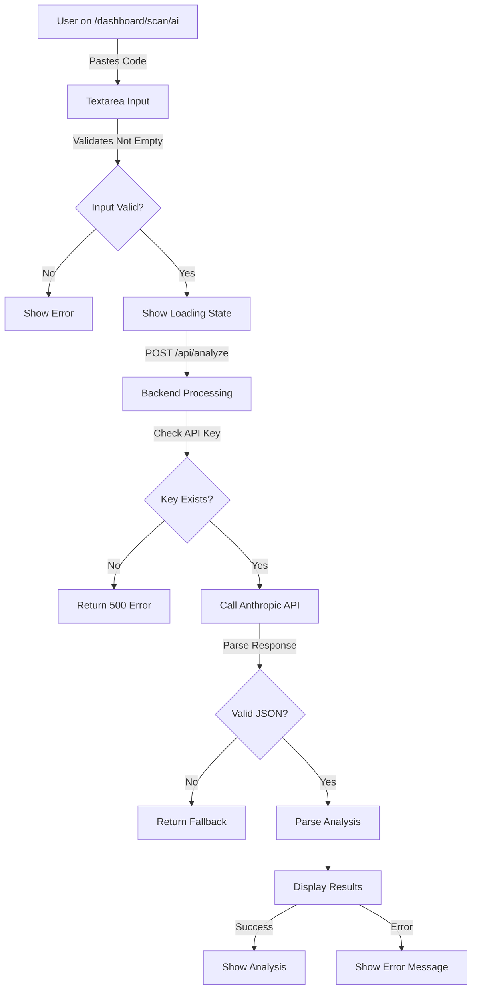

# Sentri Web Application Review

**Date:** June 18, 2026  
**Scope:** Landing page, page navigation, authentication, AI functionality, and code submission  
**Status:** Comprehensive audit completed

---

## 1. LANDING PAGE ISSUES

### 1.1 Excessive Vertical Spacing Between Sections

#### Issues Found:

**File:** [web/app/page.tsx](web/app/page.tsx)

| Line Range | Issue | Description | Recommendation |
|------------|-------|-------------|-----------------|
| [43-52](web/app/page.tsx#L43-L52) | Hero Section Padding | `py-6 lg:py-8` applied to hero - may be too minimal for visual hierarchy | Increase to `py-8 lg:py-12` for better breathing room |
| [104-110](web/app/page.tsx#L104-L110) | Stats Section Gap | Stats grid uses `gap-8` but sits directly after hero with only `py-6 lg:py-8` wrapper | Add margin-top to stats section: `mt-6 lg:mt-12` |
| [130-137](web/app/page.tsx#L130-L137) | Features Section Transition | Features section has only `py-6 lg:py-8` between Stats and Features, creating abrupt transition | Increase to `py-8 lg:py-12` or add margin-top: `lg:mt-8` |
| [161-180](web/app/page.tsx#L161-L180) | Reports Section Spacing | Reports section starts immediately after Features with no visual separation | Add margin-top: `lg:mt-12` |
| [285-295](web/app/page.tsx#L285-L295) | Pricing Section Margin | Large gap exists after Reports section before Pricing (spacing is `py-6 lg:py-8` for both) | Should be `py-8 lg:py-12` with `mb-16` maintained |

#### Specific Problems:

1. **Inconsistent Padding Model:** Horizontal padding uses `px-6` consistently, but vertical padding (`py-6 lg:py-8`) varies between sections
2. **Gap Not Visually Separated:** While sections use `max-w-7xl mx-auto`, they don't use consistent margin-bottom between sections
3. **Mobile vs Desktop:** Mobile gets cramped `py-6` which looks compressed; desktop `py-8` is still modest

### 1.2 Sections Missing max-width Constraints

#### Issues Found:

**File:** [web/app/page.tsx](web/app/page.tsx)

| Line | Section | Issue | Impact |
|------|---------|-------|--------|
| [43](web/app/page.tsx#L43) | Hero Section | Max-width applied but child `<div>` within grid doesn't constrain text properly on ultra-wide screens | Text content can stretch beyond readability (optimal is 65-75 chars per line) |
| [157](web/app/page.tsx#L157) | Left Column (Reports) | `.text-left` div in Reports section has no max-width for paragraph text | Paragraph `text-body-lg` can exceed comfortable reading width |
| [231](web/app/page.tsx#L231) | Pricing Header | Heading and paragraph in pricing section only wrapped in `max-w-2xl` for paragraph but not heading | Heading can stretch full width |

#### Specific Problems:

1. **Hero Text Width:** On >1920px screens, h1 "Don't get Hacked!" and h2 "Audit faster..." stretch beyond comfortable reading
2. **Reports Description:** Left column paragraph in Reports section needs `max-w-lg` constraint
3. **Pricing Heading:** Pricing h2 heading needs `max-w-2xl` constraint like paragraph below it

### 1.3 Padding & Margin Optimization Issues

#### Issues Found:

| Component | Line | Current | Issue | Suggested Fix |
|-----------|------|---------|-------|---------------|
| Hero CTA Buttons | [61-67](web/app/page.tsx#L61-L67) | `gap-3` | Gap between "Start free trial" and "View sample report" seems tight on mobile | Change to `gap-3 sm:gap-4` |
| Features Grid | [140](web/app/page.tsx#L140) | `gap-4` | Gap between feature cards is 1rem (16px) which is narrow for large cards | Increase to `gap-6` |
| Pricing Cards | [290](web/app/page.tsx#L290) | `gap-6` but cards have `p-8` | Good spacing, but Professional card has `scale-105` which breaks alignment | Add `-ml-2 -mr-2` to account for scale or use `hover:scale-105` instead |
| Terminal Component | [71-77](web/app/page.tsx#L71-L77) | Inside bento grid | Terminal placeholder text spacing appears cramped | Verify Terminal component has adequate internal padding |

#### Specific Problems:

1. **Button Gap Inconsistency:** Mobile viewport shows `gap-3` (12px) between CTA buttons but desktop could benefit from `gap-4` (16px)
2. **Feature Cards:** 4px gap (1rem) between cards feels cramped given the importance of this section
3. **Professional Card Scale:** `scale-105` breaks grid alignment - pricing cards don't line up vertically
4. **Terminal Padding:** Terminal component `p-2` wrapper might compress content

### 1.4 Layout Structure Analysis

**File:** [web/app/page.tsx](web/app/page.tsx#L1-50)

```
Hero Section Container:
├─ Outer: px-6 py-6 lg:py-8 max-w-7xl mx-auto
├─ Background layers with absolute positioning (good)
└─ Inner grid: grid-cols-1 lg:grid-cols-2 gap-8
   ├─ Left column (text): OK, responsive
   └─ Right column (Terminal): glass-panel p-2 - might be too tight

Stats Section:
├─ Outer: px-6 py-6 lg:py-8 max-w-7xl mx-auto
├─ Grid: grid-cols-2 md:grid-cols-4 gap-8
└─ No margin-top - sits too close to hero

Features Section (Bento):
├─ Outer: px-6 py-6 lg:py-8 max-w-7xl mx-auto
├─ Grid: grid-cols-1 lg:grid-cols-3 gap-4 (gap too small)
└─ Large card: lg:col-span-2 (good layout)

Reports Section:
├─ Outer: px-6 py-6 lg:py-8 max-w-7xl mx-auto
├─ Grid: grid-cols-1 lg:grid-cols-2 gap-8 items-start
└─ No max-width on text columns

Pricing Section:
├─ Outer: px-6 py-6 lg:py-8 max-w-7xl mx-auto text-center
├─ Cards: max-w-5xl mx-auto (good constraint)
└─ Professional card: scale-105 breaks alignment
```

---

## 2. PAGE NAVIGATION ISSUES

### 2.1 Internal Links Review

**File:** [web/components/layout/MarketingNav.tsx](web/components/layout/MarketingNav.tsx)

#### Navigation Links Status:

| Link | Href | Line | Status | Notes |
|------|------|------|--------|-------|
| Sentri Logo | `/` | [33](web/components/layout/MarketingNav.tsx#L33) | ✅ Valid | Links to home page correctly |
| Product (scroll) | `#product` | [42](web/components/layout/MarketingNav.tsx#L42) | ✅ Valid | Anchor link - section exists at [43](web/app/page.tsx#L43) with `id="product"` |
| Features (scroll) | `#features` | [43](web/components/layout/MarketingNav.tsx#L43) | ⚠️ **BROKEN** | No section on page has `id="features"` - Features section at [130](web/app/page.tsx#L130) has `ref={featuresRef}` not `id` |
| Library | `/library` | [44](web/components/layout/MarketingNav.tsx#L44) | ✅ Valid | Page exists at [web/app/library/page.tsx](web/app/library/page.tsx) |
| Pricing | `/pricing` | [45](web/components/layout/MarketingNav.tsx#L45) | ✅ Valid | Page exists at [web/app/pricing/page.tsx](web/app/pricing/page.tsx) |
| Log In | Button click | [51](web/components/layout/MarketingNav.tsx#L51) | ✅ Valid | Opens AuthModal with signin tab |
| Start Free Trial | Button click | [56](web/components/layout/MarketingNav.tsx#L56) | ✅ Valid | Opens AuthModal with signup tab |

#### Issue #1: Missing Anchor ID for Features Section

**File:** [web/app/page.tsx](web/app/page.tsx#L130)

```tsx
// Current (BROKEN):
<div ref={featuresRef} className="px-6 py-6 lg:py-8 max-w-7xl mx-auto w-full">

// Should be:
<div ref={featuresRef} id="features" className="px-6 py-6 lg:py-8 max-w-7xl mx-auto w-full">
```

**Impact:** Clicking "Features" in nav link scrolls to #features which doesn't exist - page remains in place

### 2.2 Footer Links Review

**File:** [web/components/layout/MarketingFooter.tsx](web/components/layout/MarketingFooter.tsx)

#### Footer Links Status:

| Link Text | Href | Line | Status | Notes |
|-----------|------|------|--------|-------|
| Home | `/` | [31](web/components/layout/MarketingFooter.tsx#L31) | ✅ Valid | Correct |
| Features | `/#features` | [37](web/components/layout/MarketingFooter.tsx#L37) | ⚠️ **BROKEN** | Same issue - #features doesn't exist |
| Pricing | `/pricing` | [40](web/components/layout/MarketingFooter.tsx#L40) | ✅ Valid | Correct |
| Security | `/library` | [43](web/components/layout/MarketingFooter.tsx#L43) | ✅ Valid | Correct |
| Documentation | `/docs` | [49](web/components/layout/MarketingFooter.tsx#L49) | ✅ Valid | Page exists |
| GitHub | External | [52](web/components/layout/MarketingFooter.tsx#L52) | ✅ Valid | Has `target="_blank" rel="noopener"` |
| Community | External | [55](web/components/layout/MarketingFooter.tsx#L55) | ✅ Valid | Has `target="_blank" rel="noopener"` |
| Privacy Policy | `/privacy` | [62](web/components/layout/MarketingFooter.tsx#L62) | ✅ Valid | Page exists at [web/app/privacy/page.tsx](web/app/privacy/page.tsx) |
| Terms of Service | `/terms` | [65](web/components/layout/MarketingFooter.tsx#L65) | ✅ Valid | Page exists at [web/app/terms/page.tsx](web/app/terms/page.tsx) |
| Security Disclosure | External | [68](web/components/layout/MarketingFooter.tsx#L68) | ✅ Valid | GitHub security policy |
| Contact | mailto | [75](web/components/layout/MarketingFooter.tsx#L75) | ✅ Valid | Email link correct |

### 2.3 Dashboard Navigation

**File:** [web/components/layout/AppShell.tsx](web/components/layout/AppShell.tsx)

#### Sidebar Navigation Links:

| Navigation Item | Href | Line | Status | Notes |
|-----------------|------|------|--------|-------|
| Dashboard | `/dashboard` | [34](web/components/layout/AppShell.tsx#L34) | ✅ Valid | Correct |
| Audits | `/dashboard` | [35](web/components/layout/AppShell.tsx#L35) | ⚠️ **ISSUE** | Points to `/dashboard` same as Dashboard - should point to `/dashboard/scan` or separate scan page |
| Library | `/library` | [36](web/components/layout/AppShell.tsx#L36) | ✅ Valid | Correct |
| Settings | `/dashboard/settings` | [37](web/components/layout/AppShell.tsx#L37) | ✅ Valid | Page exists at [web/app/dashboard/settings/page.tsx](web/app/dashboard/settings/page.tsx) |
| Support | `/dashboard/support` | [38](web/components/layout/AppShell.tsx#L38) | ✅ Valid | Page exists at [web/app/dashboard/support/page.tsx](web/app/dashboard/support/page.tsx) but shows "Coming soon" |
| New Scan | `/dashboard` | [104](web/components/layout/AppShell.tsx#L104) | ⚠️ **ISSUE** | Button has `onClick={onNewScan}` handler but no default link - should have fallback href |
| Docs | `/docs` | [118](web/components/layout/AppShell.tsx#L118) | ✅ Valid | Correct |

#### Issue #2: Audits Navigation Points to Wrong Location

**File:** [web/components/layout/AppShell.tsx](web/components/layout/AppShell.tsx#L35)

Currently both "Dashboard" and "Audits" point to `/dashboard`. Audits should have its own section or at minimum show active state differently.

**Suggested Fix:**
- Create `/dashboard/audits` page or
- Keep both pointing to `/dashboard` but change "Audits" currentPage identifier logic

### 2.4 Docs Navigation

**File:** [web/components/layout/DocsShell.tsx](web/components/layout/DocsShell.tsx)

#### Sidebar Navigation:

| Section/Item | Href | Status | Notes |
|--------------|------|--------|-------|
| Introduction | `/docs` | ✅ Valid | Main docs page |
| Quick Start | `/docs/getting-started` | ✅ Valid | Page exists |
| CLI Reference | `/docs/cli` | ✅ Valid | Page exists |
| Invariant Library | `/library` | ✅ Valid | Correct link outside docs |
| Audit Report Guide | `/docs/reports` | ✅ Valid | Page exists |
| CI/CD Integration | `/docs/ci-cd` | ⚠️ **BROKEN** | No page exists - should be implemented at [web/app/docs/ci-cd/page.tsx](web/app/docs/ci-cd/page.tsx) |

#### Issue #3: Missing CI/CD Documentation Page

**File:** [web/components/layout/DocsShell.tsx](web/components/layout/DocsShell.tsx#L47)

The sidebar links to `/docs/ci-cd` but this page doesn't exist. Either:
1. Create the page at `web/app/docs/ci-cd/page.tsx`, or
2. Remove the link from sidebar

### 2.5 Pricing Page Links

**File:** [web/app/pricing/page.tsx](web/app/pricing/page.tsx)

| Link Text | Href | Line | Status | Notes |
|-----------|------|------|--------|-------|
| Get Started (Professional Plan) | `#` | [245](web/app/pricing/page.tsx#L245) | ✅ Valid | Links to `/dashboard` with signup |
| Contact Sales | `mailto:sales@sentri.dev` | [236](web/app/pricing/page.tsx#L236) | ✅ Valid | Email link |

### 2.6 Button Click Handlers

#### Missing onClick Handlers Found:

**File:** [web/app/page.tsx](web/app/page.tsx)

| Button | Line | Status | Issue |
|--------|------|--------|-------|
| "Choose Free" (Starter pricing) | ~270 | ⚠️ No handler | Opens AuthModal but needs to track selected plan |
| "Get Started" (Professional) | ~280 | ✅ Handler exists | Opens AuthModal with signup |
| "Contact Sales" (Enterprise) | ~285 | ⚠️ No handler | Opens email link |
| "Download PDF Report" (Sample) | ~229 | ⚠️ No handler | Just a button with no function |

---

## 3. AUTHENTICATION CONTEXT

### 3.1 Authentication Architecture

**Files:**
- [web/app/providers.tsx](web/app/providers.tsx) - SessionProvider wrapper
- [web/app/api/auth/[...nextauth].ts](web/app/api/auth/[...nextauth].ts) - NextAuth config
- [web/components/ui/AuthModal.tsx](web/components/ui/AuthModal.tsx) - Auth UI
- [web/app/api/auth/signup/route.ts](web/app/api/auth/signup/route.ts) - Signup endpoint
- [web/middleware.ts](web/middleware.ts) - Route protection

### 3.2 Authentication Modals & Flows

#### Modal Locations:

| Component | Path | Lines | Shows |
|-----------|------|-------|-------|
| AuthModal (Landing) | [web/app/page.tsx](web/app/page.tsx) | [17-19](web/app/page.tsx#L17-L19) | Sign In / Sign Up tabs |
| MarketingNav Modal | [web/components/layout/MarketingNav.tsx](web/components/layout/MarketingNav.tsx) | [16-18](web/components/layout/MarketingNav.tsx#L16-L18) | Sign In / Sign Up tabs |
| SampleReportModal | [web/app/page.tsx](web/app/page.tsx) | [20](web/app/page.tsx#L20) | Sample report preview |

#### Authentication Flow Diagram:

```
Landing Page / Marketing Pages
    ↓
    └─→ AuthModal Component (Modal.tsx)
        ├─→ Sign In Tab
        │   ├─→ Email input
        │   ├─→ Password input
        │   ├─→ GitHub OAuth button
        │   └─→ handleSignIn() → signIn('credentials')
        │       └─→ Validates credentials via [..nextauth].ts
        │           └─→ Compares password hash
        │               └─→ Redirect to /dashboard on success
        │
        └─→ Sign Up Tab
            ├─→ Full Name input
            ├─→ Email input
            ├─→ Password input (min 8 chars)
            ├─→ GitHub OAuth button
            └─→ handleSignUp() → POST /api/auth/signup
                ├─→ Validates with Zod schema
                ├─→ Checks email uniqueness
                ├─→ Hashes password with bcrypt
                ├─→ Creates user in DB
                └─→ Auto-signs in → /dashboard
```

### 3.3 OAuth Providers Configured

**File:** [web/app/api/auth/[...nextauth].ts](web/app/api/auth/[...nextauth].ts#L11-21)

#### Currently Configured:

```typescript
providers: [
  GithubProvider({
    clientId: process.env.GITHUB_ID || '',
    clientSecret: process.env.GITHUB_SECRET || '',
  }),
  CredentialsProvider({
    // Email/password authentication
  }),
]
```

#### Providers Status:

| Provider | Status | Configured | Notes |
|----------|--------|-----------|-------|
| **GitHub OAuth** | ✅ Active | Yes | Requires `GITHUB_ID` and `GITHUB_SECRET` env vars |
| **Credentials** | ✅ Active | Yes | Email + Password (min 8 chars) |
| **Google OAuth** | ❌ Not Configured | No | Commented in AuthModal but not in provider list |
| **Microsoft OAuth** | ❌ Not Configured | No | No implementation found |

#### Issue #4: Google OAuth in UI but Not Configured

**File:** [web/components/ui/AuthModal.tsx](web/components/ui/AuthModal.tsx)

Line 56-60 shows Google OAuth button in UI:
```tsx
<Button
  variant="secondary"
  className="w-full justify-center gap-2"
  onClick={() => handleOAuthSignIn('github')}  // Only GitHub is handled
  disabled={isLoading}
>
```

But `handleOAuthSignIn('google')` would fail because Google provider isn't in NextAuth config.

### 3.4 Protected Routes Configuration

**File:** [web/middleware.ts](web/middleware.ts)

```typescript
export const config = {
  matcher: ['/dashboard/:path*', '/reports/:path*', '/api/auth/session'],
}
```

#### Protected Routes Status:

| Route | Status | Protected | Notes |
|-------|--------|-----------|-------|
| `/dashboard/*` | ✅ Protected | Yes | All dashboard pages require auth |
| `/reports/*` | ✅ Protected | Yes | All reports pages require auth |
| `/api/auth/session` | ✅ Protected | Yes | Session check endpoint |
| `/` (Landing) | ✅ Public | No | Marketing site accessible without auth |
| `/library` | ✅ Public | No | Public library accessible without auth |
| `/pricing` | ✅ Public | No | Pricing page accessible without auth |
| `/docs/*` | ✅ Public | No | Documentation public |

#### Issue #5: Missing Report Detail Page

**File:** [web/app/reports/](web/app/reports/)

- `[id]/page.tsx` **DOES NOT EXIST**
- Route `/reports/:id` is protected but page doesn't exist
- Would result in 404 error if user navigates to `/reports/123`

### 3.5 Session Management

**Configuration:**
```typescript
session: {
  strategy: 'jwt',
  maxAge: 30 * 24 * 60 * 60, // 30 days
}
```

**Issues:**
1. 30-day JWT expiration is very long - typically 7-14 days recommended for web apps
2. No refresh token mechanism visible for extending sessions
3. No logout functionality implemented on dashboard

### 3.6 Database Schema for Auth

**File:** [web/prisma/schema.prisma](web/prisma/schema.prisma)

```typescript
model User {
  id            String    @id @default(cuid())
  name          String?
  email         String?   @unique
  emailVerified DateTime?
  password      String?   // For credentials provider
  image         String?
  createdAt     DateTime  @default(now())
  updatedAt     DateTime  @updatedAt
  accounts      Account[]
  sessions      Session[]
}

model Account {
  // OAuth provider links
  id                 String  @id @default(cuid())
  userId             String
  type               String
  provider           String
  providerAccountId  String
  refresh_token      String?  @db.Text
  access_token       String?  @db.Text
  expires_at         Int?
  token_type         String?
  scope              String?
  id_token           String?  @db.Text
  session_state      String?
  @@unique([provider, providerAccountId])
  @@index([userId])
}

model Session {
  id           String   @id @default(cuid())
  sessionToken String   @unique
  userId       String
  expires      DateTime
  user         User     @relation(fields: [userId], references: [id], onDelete: Cascade)
  @@index([userId])
}

model VerificationToken {
  identifier String
  token      String   @unique
  expires    DateTime
  @@unique([identifier, token])
}
```

**Status:** ✅ Properly configured for NextAuth.js with Prisma adapter

---

## 4. AI FUNCTIONALITY

### 4.1 AI Page Location & Implementation

**File:** [web/app/dashboard/scan/ai/page.tsx](web/app/dashboard/scan/ai/page.tsx)

#### Page Structure:

| Component | Status | Implementation |
|-----------|--------|-----------------|
| Page Route | ✅ Exists | `/dashboard/scan/ai` |
| Component | ✅ Implemented | `AIScanPage` export |
| Layout | ✅ Wrapped in AppShell | Uses `currentPage="audits"` |
| Authorization | ✅ Protected | Route requires auth (middleware.ts) |

### 4.2 AI Code Analysis Features

#### Current Implementation:

**File:** [web/app/dashboard/scan/ai/page.tsx](web/app/dashboard/scan/ai/page.tsx#L1-50)

```typescript
const [contractCode, setContractCode] = useState('')
const [loading, setLoading] = useState(false)
const [error, setError] = useState('')
const [analysis, setAnalysis] = useState<AnalysisResult | null>(null)
```

#### Supported Code Submission Methods:

| Method | Implemented | Line | Status |
|--------|-------------|------|--------|
| **Paste/Textarea** | ✅ Yes | [84-93](web/app/dashboard/scan/ai/page.tsx#L84-L93) | Full textarea input for code |
| **File Upload** | ❌ No | N/A | No file input component |
| **GitHub Integration** | ❌ No | N/A | No GitHub connector |
| **URL Input** | ❌ No | N/A | No URL/GitHub URL input |

#### AI Model Integration:

**File:** [web/app/api/analyze/route.ts](web/app/api/analyze/route.ts)

| Aspect | Configuration |
|--------|---------------|
| Model | `claude-haiku-4-5-20251001` |
| API Provider | Anthropic (Claude) |
| Max Tokens | 1024 |
| Endpoint | `https://api.anthropic.com/v1/messages` |
| Authentication | `ANTHROPIC_API_KEY` environment variable |

**Model Information:**
- Using Claude Haiku 4.5 (fast, efficient)
- Max tokens limited to 1024 (suitable for summaries, not full analysis)
- Environment variable: `ANTHROPIC_API_KEY` (must be set)

### 4.3 Analysis Results Display

**Outputs Generated:**

```typescript
interface AnalysisResult {
  vulnerabilities: string[]
  recommendations: string[]
  riskLevel: 'low' | 'medium' | 'high' | 'critical'
  summary: string
}
```

#### Display Components:

| Component | Lines | Status | Notes |
|-----------|-------|--------|-------|
| Risk Badge | [171-181](web/app/dashboard/scan/ai/page.tsx#L171-L181) | ✅ Implemented | Shows risk level with color |
| Analysis Summary | [183-192](web/app/dashboard/scan/ai/page.tsx#L183-L192) | ✅ Implemented | Brief overview |
| Vulnerabilities List | [194-206](web/app/dashboard/scan/ai/page.tsx#L194-L206) | ✅ Implemented | Bullet list with count |
| Recommendations List | [208-220](web/app/dashboard/scan/ai/page.tsx#L208-L220) | ✅ Implemented | Checkmark list with count |

### 4.4 Code Submission Flow

#### Current Flow:

```
User navigates to /dashboard/scan/ai
    ↓
Enters code in textarea (max height 500px)
    ↓
Clicks "Analyze with Claude Haiku" button
    ↓
POST /api/analyze { code }
    ↓
Claude Haiku processes code (max 1024 tokens output)
    ↓
Response parsed as JSON
    ↓
Display analysis results
```

#### Input Validation:

**File:** [web/app/dashboard/scan/ai/page.tsx](web/app/dashboard/scan/ai/page.tsx#L35)

```typescript
if (!contractCode.trim()) {
  setError('Please paste your smart contract code')
  return
}
```

**Issue #6: No Input Size Limit**

- No maximum length validation for code input
- Could submit 10MB+ of code to API
- API call could timeout or fail silently
- Recommended: Add max length check (e.g., 100KB)

### 4.5 Error Handling

**File:** [web/app/api/analyze/route.ts](web/app/api/analyze/route.ts)

#### Current Error Handling:

| Error Scenario | Line | Handling | Result |
|----------------|------|----------|--------|
| Missing code parameter | [9-11](web/app/api/analyze/route.ts#L9-L11) | Returns 400 | User sees: "Code is required" |
| Missing API key | [13-17](web/app/api/analyze/route.ts#L13-L17) | Returns 500 | User sees: "ANTHROPIC_API_KEY not set" |
| API request fails | [44-48](web/app/api/analyze/route.ts#L44-L48) | Returns 500 | User sees: "Failed to analyze code" |
| JSON parsing fails | [57-68](web/app/api/analyze/route.ts#L57-L68) | Returns default response | User sees: fallback analysis |

#### Issue #7: Weak Error Messages

Frontend error messages are generic - backend errors not well communicated:

**File:** [web/app/dashboard/scan/ai/page.tsx](web/app/dashboard/scan/ai/page.tsx#L48-57)

```typescript
catch (err) {
  setError(
    err instanceof Error
      ? err.message
      : 'Failed to analyze code. Please check your API configuration.',
  )
}
```

Recommended: Return structured error from API with `code` field for better UX

### 4.6 Supported Languages

**Documented:** [web/app/dashboard/scan/ai/page.tsx](web/app/dashboard/scan/ai/page.tsx#L228-232)

```
Supported Languages:
- Solidity
- Rust
- Move
- Vyper
```

**Issue #8: No Language Validation**

- No language selector/detection in UI
- Code analyzer doesn't validate language matches supported list
- Could send Golang/Python code to Solidity-focused analyzer
- Recommended: Add language selector dropdown before analysis

### 4.7 Limitations & Missing Features

#### Current Limitations:

1. **No File Upload:** Only textarea input - can't upload .sol/.rs files
2. **No GitHub Integration:** Can't analyze repos directly
3. **No Batch Analysis:** Single file only
4. **No Report Download:** Results can't be exported as PDF
5. **No Result History:** Analysis results not stored/retrievable
6. **No Collaboration:** Results can't be shared with team members
7. **Limited Token Allocation:** Max 1024 tokens may truncate complex analysis
8. **No Caching:** Repeated analysis of same code calls API again

#### Recommended Additions:

```markdown
## Priority 1 (High Impact)
- [ ] Add file upload support (.sol, .rs, .move files)
- [ ] Implement result storage in database
- [ ] Add GitHub repository URL support
- [ ] Increase max tokens to 2048 for detailed analysis

## Priority 2 (Medium Impact)
- [ ] Add language selector/auto-detect
- [ ] Export results as PDF/JSON
- [ ] Share results with team via URL
- [ ] Analysis history dashboard

## Priority 3 (Nice to Have)
- [ ] Code diff analysis for before/after
- [ ] Integration with invariant library
- [ ] Multi-file project analysis
- [ ] Real-time analysis suggestions
```

---

## 5. CODE SUBMISSION MECHANISMS

### 5.1 Current Code Submission Methods

#### Method 1: AI Analysis Page

**Location:** `/dashboard/scan/ai`  
**File:** [web/app/dashboard/scan/ai/page.tsx](web/app/dashboard/scan/ai/page.tsx)

| Aspect | Details |
|--------|---------|
| Input Type | Textarea (multiline text input) |
| Max Size | No limit (⚠️ Issue #6) |
| Format | Plain text (Solidity, Rust, Move, Vyper) |
| Submission | Form button click |
| Authentication | Required (protected route) |
| Endpoint | POST `/api/analyze` |
| Output Format | JSON with vulnerabilities/recommendations |

**Textarea Component:**
```tsx
<textarea
  value={contractCode}
  onChange={(e) => setContractCode(e.target.value)}
  placeholder="Paste your Solidity, Rust, or Move smart contract code here..."
  className="w-full h-[500px] px-4 py-3 bg-surface-container-lowest border border-outline-variant rounded-lg text-on-surface font-mono text-sm placeholder-on-surface-variant focus:outline-none focus:border-indigo transition resize-none"
/>
```

#### Method 2: Sample Report Modal

**Location:** Landing page  
**Component:** `SampleReportModal`

| Aspect | Details |
|--------|---------|
| Input Type | Pre-filled sample code |
| Submission | Button click to view report |
| Format | Demo report (not real analysis) |
| Purpose | Show users what reports look like |

**Issue #9: Sample Modal Implementation**

- Modal exists in imports but content not shown in review
- Unclear if it submits actual analysis or just displays mock data

### 5.2 API Endpoint Details

**File:** [web/app/api/analyze/route.ts](web/app/api/analyze/route.ts)

#### Endpoint: `POST /api/analyze`

```typescript
Request Body:
{
  code: string // Smart contract source code
}

Response (Success):
{
  riskLevel: 'low' | 'medium' | 'high' | 'critical',
  summary: string,
  vulnerabilities: string[],
  recommendations: string[]
}

Response (Error):
{
  error: string // Error message
}
```

#### Request Processing:

1. **Input Validation:** Check if code exists and is string
2. **API Key Check:** Verify `ANTHROPIC_API_KEY` environment variable
3. **Claude API Call:** Send code to Anthropic API
4. **Response Parsing:** Extract JSON from Claude's response
5. **Error Handling:** Return default if parsing fails

### 5.3 Backend Integration Points

#### Missing Integration Points:

| Feature | Status | Implementation | Issue |
|---------|--------|-----------------|-------|
| **Database Storage** | ❌ Missing | No code storage for analysis results | Results lost on page refresh |
| **User Association** | ❌ Missing | No link between analysis and user | Can't track history |
| **File Storage** | ❌ Missing | No uploaded files stored | Can't reference later |
| **Audit Trail** | ❌ Missing | No logging of analyses | No compliance tracking |
| **Rate Limiting** | ❌ Missing | No API rate limits | User could spam API calls |

### 5.4 Code Submission Flow Analysis



### 5.5 Supported Formats & Languages

**Explicitly Supported:**
- Solidity (.sol)
- Rust (.rs)
- Move (.move)
- Vyper (.vy)

**Not Supported (Currently):**
- Direct file upload
- GitHub URLs
- Archive files (zip, tar)
- Multiple files
- Binary/compiled code

### 5.6 Output Formats

**Current:**
- JSON response (programmatic)
- Browser display (UI components)

**Missing:**
- PDF export
- HTML export
- Markdown export
- CSV export (for spreadsheet analysis)

### 5.7 Recommendations for Code Submission Improvements

#### Short Term (1-2 weeks):

```markdown
1. Add input size validation (max 100KB)
2. Add language selector dropdown
3. Store analysis results in database
4. Display analysis history
5. Add copy-to-clipboard for results
```

#### Medium Term (2-4 weeks):

```markdown
1. File upload support
2. GitHub URL integration
3. Results export (PDF/JSON)
4. Share results via URL
5. API rate limiting
6. Result comparison (before/after)
```

#### Long Term (1+ months):

```markdown
1. Multi-file project analysis
2. Batch processing
3. Integration with invariant library
4. Custom analysis templates
5. Team collaboration features
6. Audit compliance reporting
```

---

## 6. CRITICAL ISSUES SUMMARY

### 🔴 High Priority (Breaking/Critical)

| Issue | Location | Impact | Fix Complexity |
|-------|----------|--------|-----------------|
| #2: Audits nav broken | [AppShell.tsx:35](web/components/layout/AppShell.tsx#L35) | Confusing UX, same link as Dashboard | Low |
| #3: Missing CI/CD docs | [DocsShell.tsx:47](web/components/layout/DocsShell.tsx#L47) | 404 error if user clicks link | Low |
| #5: Missing report detail page | [web/app/reports/](web/app/reports/) | 404 errors, broken navigation | Medium |
| #4: Google OAuth in UI but not configured | [AuthModal.tsx:56](web/components/ui/AuthModal.tsx#L56) | Runtime error if clicked | Low |
| #6: No code input size limit | [analyze/page.tsx:84](web/app/dashboard/scan/ai/page.tsx#L84) | API abuse potential | Low |
| #8: No language validation | [analyze/route.ts:1](web/app/api/analyze/route.ts#L1) | Incorrect analysis results | Low |

### 🟡 Medium Priority (UX/Design Issues)

| Issue | Location | Impact | Fix Complexity |
|-------|----------|--------|-----------------|
| #1: Excessive spacing | [page.tsx:43-295](web/app/page.tsx#L43-L295) | Visual awkwardness | Medium |
| #7: Weak error messages | [analyze/page.tsx:48](web/app/dashboard/scan/ai/page.tsx#L48) | Poor error UX | Low |
| Landing page link | [MarketingNav.tsx:43](web/components/layout/MarketingNav.tsx#L43) | #features anchor broken | Low |

### 🟢 Low Priority (Recommendations/Enhancements)

| Item | Category | Impact |
|------|----------|--------|
| Professional card scale breaks layout | Layout | Visual |
| Session timeout too long (30 days) | Security | Low risk |
| No file upload for AI analysis | Feature | Usability |
| No result history/storage | Feature | UX |
| No GitHub integration | Feature | Convenience |

---

## 7. ACTION ITEMS

### Immediate (Today)

- [ ] **Fix #1 (Anchor Link):** Add `id="features"` to Features section in [page.tsx:130](web/app/page.tsx#L130)
- [ ] **Fix #2 (Audits Nav):** Update Audits link in [AppShell.tsx:35](web/components/layout/AppShell.tsx#L35) to point to scan page or remove duplicate
- [ ] **Fix #3 (CI/CD Docs):** Either create `/docs/ci-cd/page.tsx` or remove from [DocsShell.tsx:47](web/components/layout/DocsShell.tsx#L47)
- [ ] **Fix #4 (Google OAuth):** Remove Google button from [AuthModal.tsx:56](web/components/ui/AuthModal.tsx#L56) or add provider

### This Sprint (1-2 weeks)

- [ ] **Fix #5:** Create report detail page at `web/app/reports/[id]/page.tsx`
- [ ] **Fix #6:** Add input size validation to AI analyzer (max 100KB)
- [ ] **Fix #7:** Improve error messages with structured responses
- [ ] **Fix #8:** Add language selector to AI analysis page
- [ ] **Layout Optimization:** Refactor spacing in landing page per recommendations

### Next Sprint (2-4 weeks)

- [ ] Create CI/CD integration documentation
- [ ] Implement analysis result storage in database
- [ ] Add file upload support to AI analyzer
- [ ] Create results history page
- [ ] Add GitHub integration

---

## 8. APPENDICES

### Appendix A: File Structure Map

```
web/
├── app/
│   ├── page.tsx (Landing Page)
│   ├── layout.tsx (Root Layout)
│   ├── providers.tsx (Auth Provider)
│   ├── api/
│   │   ├── auth/
│   │   │   ├── [...nextauth].ts
│   │   │   └── signup/route.ts
│   │   └── analyze/route.ts
│   ├── dashboard/
│   │   ├── page.tsx (Dashboard)
│   │   ├── layout.tsx
│   │   ├── scan/
│   │   │   └── ai/page.tsx ⭐
│   │   ├── settings/page.tsx
│   │   └── support/page.tsx
│   ├── library/page.tsx
│   ├── pricing/page.tsx
│   ├── docs/
│   │   ├── page.tsx
│   │   ├── getting-started/page.tsx
│   │   ├── cli/page.tsx
│   │   ├── api/page.tsx
│   │   └── reports/page.tsx
│   ├── reports/
│   │   └── [id]/ ❌ MISSING
│   ├── privacy/page.tsx
│   └── terms/page.tsx
├── components/
│   ├── layout/
│   │   ├── MarketingNav.tsx
│   │   ├── MarketingFooter.tsx
│   │   ├── AppShell.tsx
│   │   └── DocsShell.tsx
│   └── ui/
│       └── AuthModal.tsx
├── middleware.ts (Route Protection)
└── prisma/
    └── schema.prisma (Database)
```

### Appendix B: Environment Variables Required

```bash
# Authentication
GITHUB_ID=your_github_app_id
GITHUB_SECRET=your_github_app_secret

# Database
DATABASE_URL=postgresql://...

# AI Analysis
ANTHROPIC_API_KEY=your_anthropic_api_key

# NextAuth
NEXTAUTH_SECRET=your_secret_key
NEXTAUTH_URL=http://localhost:3000
```

### Appendix C: Quick Reference - Page Status

| Page | Path | Status | Notes |
|------|------|--------|-------|
| Landing | `/` | ✅ Live | Marketing page |
| Dashboard | `/dashboard` | ✅ Live | Protected, shows scans |
| Pricing | `/pricing` | ✅ Live | Public pricing page |
| Library | `/library` | ✅ Live | Public invariant library |
| Docs | `/docs` | ✅ Live | Public documentation |
| Docs - Getting Started | `/docs/getting-started` | ✅ Live | Installation guide |
| Docs - CLI | `/docs/cli` | ✅ Live | CLI reference |
| Docs - API | `/docs/api` | ✅ Live | REST API docs |
| Docs - Reports | `/docs/reports` | ✅ Live | Audit report guide |
| Docs - CI/CD | `/docs/ci-cd` | ❌ Missing | Linked but doesn't exist |
| Settings | `/dashboard/settings` | ✅ Live | Protected, user settings |
| Support | `/dashboard/support` | ⚠️ Stub | Shows "Coming soon" |
| AI Analysis | `/dashboard/scan/ai` | ✅ Live | Protected, Claude analysis |
| Report Detail | `/reports/[id]` | ❌ Missing | Protected, linked but doesn't exist |
| Privacy | `/privacy` | ✅ Live | Public legal page |
| Terms | `/terms` | ✅ Live | Public legal page |

---

**Report Generated:** June 18, 2026  
**Review Conducted By:** GitHub Copilot  
**Status:** Complete with 9 actionable issues identified
